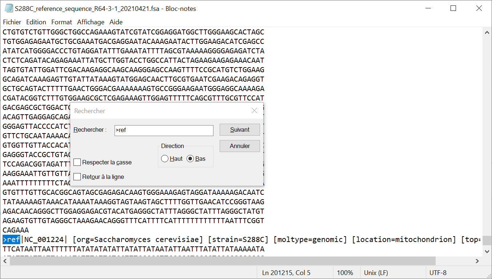

# Éditeurs de texte

## Préparation

1. Vérifiez que le logiciel *Notepad++* est installé sur votre machine en essayant de le lancer (puis en le refermant). Si ce n'est pas le cas, installez-le, en suivant la notice détaillée [ici](install-notepadpp/README). Si le logiciel vous demande de se mettre à jour, acceptez et suivez la procédure.
1. Vérifiez également que le logiciel *7-zip* est installé (toujours en le lançant puis en le refermant). Si ce n'est pas le cas, installez-le en suivant la notice détaillée [ici](install-7zip/README).


## Visualisation du génome avec *Bloc-notes*

1. Décompressez le fichier *S288C_reference_sequence_R64-3-1_20210421.fsa.gz*.  
    Pour cela, cliquez droit sur le fichier puis sélectionnez *7-zip -> Extraire Ici*.
    Un nouveau fichier *S288C_reference_sequence_R64-3-1_20210421.fsa* devrait apparaître dans le même répertoire.
1. Ouvrez le fichier *S288C_reference_sequence_R64-3-1_20210421.fsa* avec *Bloc-notes*.  
    Remarque : lancez d'abord *Bloc-notes* puis glisser-déposez le fichier sur l'application.
1. Quel est le nombre maximum de bases par ligne ?
1. Combien de séquences sont disponibles dans ce fichier ?
    Pour cela, pressez les touches <kbd>Ctrl</kbd>+<kbd>F</kbd>, entrez le motif `>ref` dans le champ *Rechercher* puis cliquez sur le bouton *Suivant* ([aide](img/bloc-notes_recherche.png)).  
    Combien de séquences trouvez-vous ?
1. En utilisant la même procédure, mais cette fois, en recherchant le mot clé `chromosome`, déterminez le nombre de chromosomes de *S. cerevisiae* ([aide](img/bloc-notes_recherche_chromo.png)).
1. À quoi correspond la séquence qui n'est pas un chromosome ?
1. Fermez l'application *Bloc-notes*.


```{admonition} Éléments de réponse
:class: tip, dropdown

Quand on ouvre le fichier *S288C_reference_sequence_R64-3-1_20210421.fsa* avec *Bloc-notes* on obtient :


Les lignes de séquences sont formatées avec un maximum de 60 bases par ligne.

La fonction *Rechercher* (obtenue en pressant les touches <kbd>Ctrl</kbd>+<kbd>F</kbd>) permet de retrouver toutes les séquences :


En cliquant plusieurs fois sur le bouton *Suivant*, on trouve 17 séquences.
 
En cherchant le mot-clé `chromosome`, on trouve 16 chromosomes.


 
La 17e séquence correspond à la séquence de l'ADN mitochondrial :

```


## Visualisation du génome avec *Notepad++*

1. Ouvrez le même fichier avec l'éditeur de texte *Notepad++*.  
    Remarque : lancez d'abord *Notepad++* puis glisser-déposez le fichier sur l'application.
1. Que signifie `Unix (LF)` dans la barre en bas de la fenêtre ?
1. Avec votre souris, sélectionnez une ligne entière contenant un morceau de séquence puis regardez la barre en bas de la fenêtre.  
    Sur combien de caractères par ligne sont réparties les séquences des chromosomes de *S. cerevisiae* ?
1. Vérifiez que tous les chromosomes de *S. cerevisiae* sont présents en pressant les touches <kbd>Ctrl</kbd>+<kbd>F</kbd> puis en entrant le motif `chromosome` puis en cliquant sur le bouton *Suivant*.
1. Voyez-vous un moyen de compter très rapidement le nombres de chromosomes ?

[*Notepad++*](https://notepad-plus-plus.org/) est beaucoup plus puissant que *Bloc-notes* et c'est un logiciel libre (*open source*). Nous vous recommandons fortement son utilisation si vous êtes sous Windows !


```{admonition} Éléments de réponse
:class: tip, dropdown

Quand on ouvre le fichier *S288C_reference_sequence_R64-3-1_20210421.fsa* avec *Notepad++* on obtient :


La mention `Unix(LF)` dans la barre en bas de la fenêtre signifie que le fichier a été créé sous Unix pour lequel les fins de lignes sont `LF` (contre `CR+LF` pour un fichier créé sous Windows).

En sélectionnant une ligne complète, la barre en bas indique le nombre de caractères. Ici 60.


En utilisant la fonction *Rechercher* de *Notepad++*, on retrouve les 16 chromosomes.


On peut même les compter très rapidement en cliquant sur le bouton *Compter* :


On peut automatiser très simplement cette recherche de motif (`chromosome`) et le comptage associé pour des dizaines voire des milliers de fichiers avec un outil comme Unix que nous aborderons prochainement.
```
