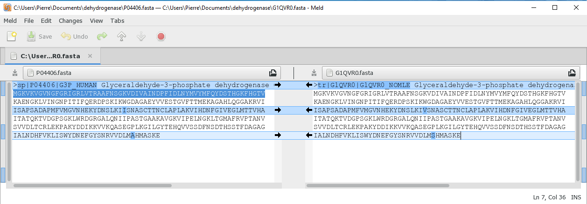

# Jeu des différences

## Préparation

```{note}
*Meld* est un logiciel qui permet de comparer des fichiers texte et de visualiser leurs différences. C'est un logiciel libre et gratuit, disponible pour Linux, Mac et Windows et que vous pouvez installer sur votre machine.
À toute fin utile, voici une [notice détaillée](install-meld/README) pour installer *Meld* sous Windows.
```

Vérifiez que le logiciel *Meld* est installé.

Téléchargez les séquences protéiques, au format FASTA, de la déhydrogénase :
- de l'homme ([P04406](https://www.uniprot.org/uniprot/P04406)) - [fichier FASTA](files/P04406.fasta)
- du gibbon à favoris blancs du Nord ([G1QVR0](https://www.uniprot.org/uniprot/G1QVR0)) - [fichier FASTA](files/G1QVR0.fasta)

```{note}
Vos fichiers FASTA sont a priori dans le répertoire *Téléchargements*.
```


## Recherche des différences entre deux séquences de déhydrogénase avec Meld

```{note}
Si *Meld* n'est pas installé sur votre machine. Utilisez le site [*Mergely*](https://editor.mergely.com/) qui permet de comparer deux fichiers texte en ligne.
```

1. Lancez *Meld*, cliquez sur *File comparison*, cliquez sur *(None)* et sélectionnez les deux fichiers FASTA l'un après l'autre ([aide](img/meld_file_comp.png)). Enfin, cliquez sur *Compare*.
1. Identifiez les positions et les types des acides aminés qui diffèrent entre les deux séquences.

```{admonition} Éléments de réponse
:class: tip, dropdown



Les deux acides aminés différents entre l'homme et le gibbon sont :

| Position | Homme | Gibbon |
|----------|-------|--------|
| 147      | Ile   | Val    |
| 329      | Ala   | Ser    |

Le calcul de la position se fait en repérant le numéro (dans la barre en bas de la fenêtre) du caractère correspondant à la mutation puis en ajoutant le nombre de caractères des lignes d'avant (60 caractères par ligne).

Cette méthode est bien sur « artisanale ». Pour des séquences plus grandes ou plus nombreuses, il faudrait automatiser cette comparaison avec un programme écrit en Python ou en R par exemple 😇.
```


## Recherche des différences entre deux séquences de déhydrogénase avec Notepad++

L'éditeur de texte *Notepad++* propose une extension qui permet, tout comme *Meld* de comparer deux fichiers textes.

En suivant les instructions de cet [article de blog](https://www.it-connect.fr/comment-comparer-deux-fichiers-avec-notepad/) sur le sujet et de la [vidéo correspondante](https://www.youtube.com/watch?v=bLWv-GOxJX8), installez le module *Compare* dans *Notepad++*.

Ouvrez ensuite les deux fichiers FASTA précédents (`P04406.fasta` et `G1QVR0.fasta`) dans *Notepad++*.

Comparez les fonctionnalités et l'ergonomie du module *Compare* de *Notepad++* par rapport à *Meld*.

Essayez maintenant d'installer le module *ComparePlus* qui est normalement plus ergonomique que *Compare*. Comparez-le à *Meld*.
