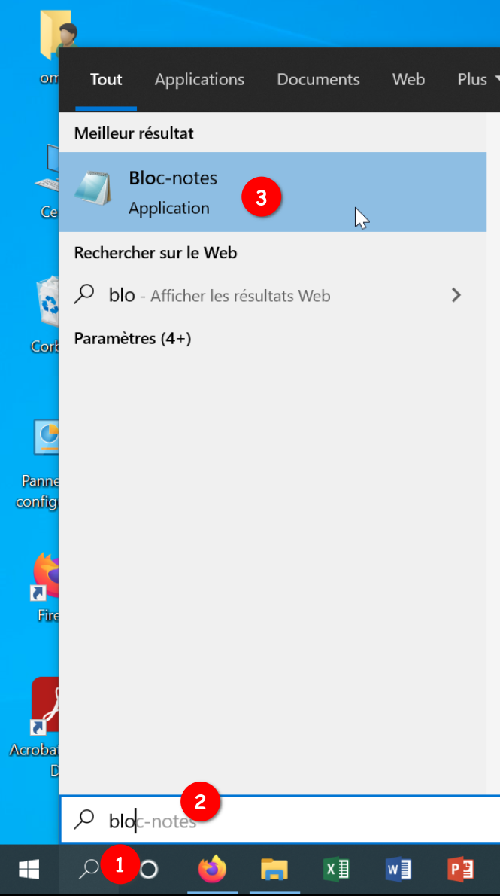
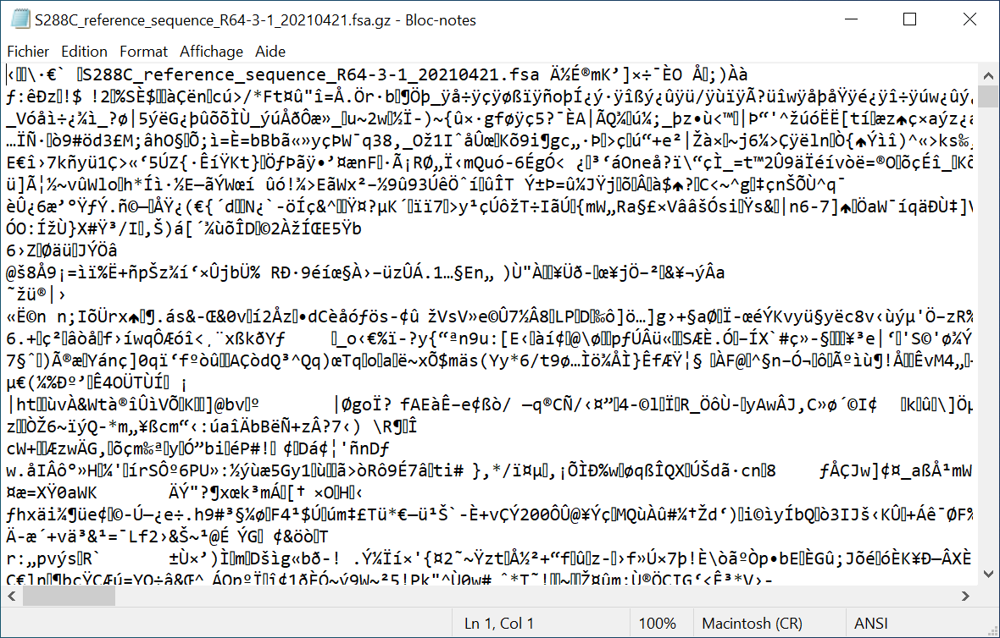

# Exploration du génome de *Sacharomyces cerevisiae*

1. Téléchargez le génome de *S. cerevisiae* :
[*S288C_reference_sequence_R64-3-1_20210421.fsa.gz*](files/S288C_reference_sequence_R64-3-1_20210421.fsa.gz).
    Ce fichier provient de la [Saccharomyces Genome Database (SGD)](https://www.yeastgenome.org/).
1. Trouvez où ce fichier a été téléchargé sur votre ordinateur (a priori dans le répertoire *Téléchargements*), puis déterminez sa taille.
1. Essayez maintenant d'ouvrir le fichier téléchargé avec l'application *Bloc-notes* de Windows. Pour ce faire :
    - Lancez d'abord *Bloc-notes* avec la petite loupe dans la barre d'outils en bas ([aide](img/bloc-notes_aide.png)).

    ```{admonition} Éléments de réponse
    :class: tip, dropdown

    
    ```

    - Puis glisser-déposez le fichier sur l'application.
    - Que lisez-vous ?
1. Fermez l'application *Bloc-notes*.


```{admonition} Éléments de réponse
:class: tip, dropdown

Le fichier se trouve a priori dans le répertoire *Téléchargements*. Le fichier a une taille d'environ 3,7 Mo.

Quand on ouvre le fichier *S288C_reference_sequence_R64-3-1_20210421.fsa.gz* avec l'application *Bloc-notes*, on obtient quelque chose d'équivalent :



Le fichier n'est pas très lisible. C'est normal car *S288C_reference_sequence_R64-3-1_20210421.fsa.gz* n'est pas un fichier texte. C'est un fichier compressé donc binaire.

On ne peut pas ouvrir de fichier binaire avec un éditeur de texte. En fait, on peut techniquement (vous venez de le faire), mais cela n'a aucun intérêt.
```
