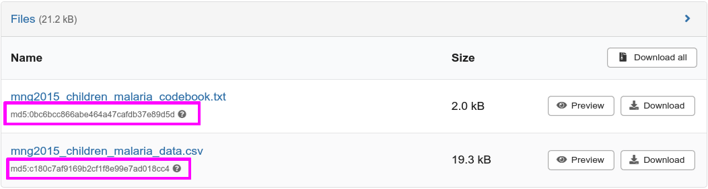

# Contrôle d'intégrité

## Préparation

Sur le site [Zenodo](https://zenodo.org/), vous trouverez les données d'une étude sur le paludisme publié en 2016 : *Plasmodium falciparum infection in febrile Congolese children: prevalence of clinical malaria 10 years after introduction of artemisinin-combination therapies*, Etoka-Beka *et al.*, TMIH. [DOI 10.1111/tmi.12786](https://onlinelibrary.wiley.com/doi/10.1111/tmi.12786).

```{note}
Zenodo est un site intéressant pour partager certaines données scientifiques.
```

Ouvrez [le dépôt Zenodo](https://zenodo.org/record/154453) correspondant à ces données.

En bas de la page, dans la rubrique *Files*, téléchargez les fichiers :

- `mng2015_children_malaria_codebook.txt`
- `mng2015_children_malaria_data.csv`

en cliquant sur le bouton *Download*.

Si lors du téléchargement, Firefox vous demande quoi faire avec ces fichiers, choisissez *Enregistrer le fichier*.

Notez les empreintes MD5 fournies sous chaque fichier :



Repérez où ont été téléchargés les fichiers (a priori dans le répertoire *Téléchargements*).


## Calcul des empreintes

Ouvrez le site [*MD5 File Checksum*](https://emn178.github.io/online-tools/md5_checksum.html) dans votre navigateur web.

Glissez / déposez le fichier `mng2015_children_malaria_codebook.txt` sur la zone « *Drag and drop the file here or click to select a file* » (ou cliquez sur cette zone pour sélectionner le fichier).

Comparez l'empreinte MD5 calculée (dans le champ texte *Output*) avec l'empreinte fournie sur le site Zenodo d'où vous avez téléchargé les données.

Répétez l'opération avec le fichier `mng2015_children_malaria_data.csv`.

Ouvrez maintenant le fichier `mng2015_children_malaria_data.csv` avec *Notepad++* et remplacez le 1er caractère de la 1ère ligne (`p`) par `P` (majuscule). Enregistrez le fichier modifié.

Calculez la nouvelle somme de contrôle du fichier `mng2015_children_malaria_data.csv` et comparez-la à la précédente.

```{admonition} Éléments de réponse
:class: tip, dropdown

Si les deux fichiers ont été téléchargés correctement, les empreintes calculées doivent normalement correspondre à celles indiquées sur Zenodo.

Une fois le premier caractère du fichier `mng2015_children_malaria_data.csv` modifié, l'empreinte MD5 obtenue est totalement différente de la première.

Il n'y a **aucune relation** entre deux sommes de contrôle même s'il n'y a qu'un seul caractère de différence entre les deux fichiers.
```


## Collision 😱

```{warning}
Attention, cette cascade n'a pas été réalisée par un professionnel, essayez de la reproduire chez vous.
```
Téléchargez les deux images ci-dessous en cliquant droit sur chaque image puis en choisissant *Enregistrer l'image sous...*.


Toujours avec le site [*MD5 File Checksum*](https://emn178.github.io/online-tools/md5_checksum.html), calculez l'empreinte MD5 de ces deux photos (`souvlaki_coll.jpg` et `gyra_coll.jpg`, l'extension `.jpg` peut ne pas apparaitre dans l'explorateur de fichiers).

Notez bien l'empreinte à chaque fois. 

Comparez ensuite les deux empreintes. Si elles sont identiques, alors que les deux images sont pourtant bien différentes, vous venez d'assister à une collision de l'algorithme MD5. Bravo ! 🥳

```{admonition} Éléments de réponse
:class: tip, dropdown

Pour les deux images, l'empreinte MD5 est `59bbfd270bdf5817c5d77e739839a02a`.
```

La collision MD5 que vous avez observée n'est pas due au hasard. Un algorithme particulier a été utilisé pour créer volontairement cette collision.

L'algorithme MD5 est donc à proscrire en sécurité informatique. Il est néanmoins parfaitement utilisable (et encore très utilisé) dans un contexte scientifique.

Source : les images proviennent du blog [Emaragkos.gr](https://emaragkos.gr/infosec-adventures/create-your-own-md5-collisions/).
