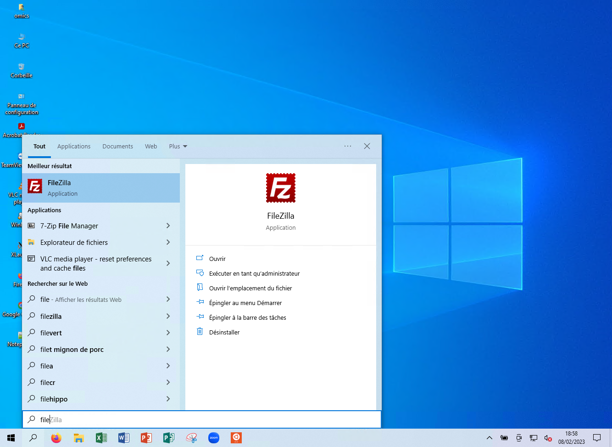
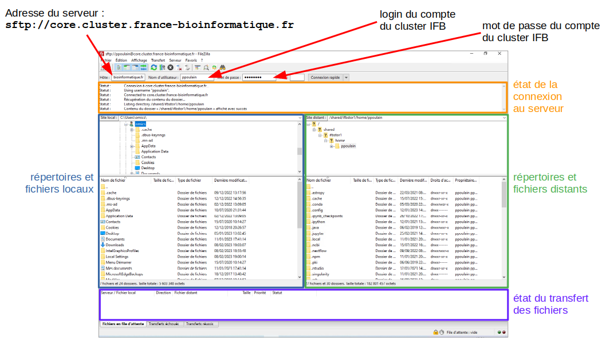

# Transfert de données

Le dernier aspect abordé dans ce tutoriel concerne le transfert de données, depuis votre machine locale vers un serveur distant (le serveur de l'IFB par exemple) et inversement.

```{warning}
Pour cette partie, vous aurez besoin de vos identiants IFB (login et mot de passe). Pensez à vérifier que vous êtes bien en leur possession.
```


## Connexion au serveur IFB

Nous allons pour cela utiliser le logiciel [FileZilla](https://filezilla-project.org/), logiciel libre et gratuit, disponible pour Windows, Linux et Mac.

1. Lancez d'abord *FileZilla* avec la petite loupe dans la barre d'outils en bas.

    ```{admonition} Aide
    :class: hint, dropdown

    
    ```

1. Tout en haut, dans le champ *Hôte* indiquez l'adresse du serveur de l'IFB : 
    ```
    sftp://core.cluster.france-bioinformatique.fr
    ```
    (voir remarque plus bas concernant l'adresse du serveur).
1. Dans le champ *Nom d'utilisateur*, indiquez le nom d'utilisateur de votre compte sur le serveur de l'IFB.
1. Dans le champ *Mot de passe*, indiquez le mot de passe de votre compte sur le serveur de l'IFB.
1. Cliquez enfin sur le bouton *Connexion rapide*.

Lors de la première connexion : 

1. Acceptez d'enregistrer vos informations de connexion dans FileZilla.
2. Dans la fenêtre *Clef de l'hôte inconnue*, cochez « *Toujours faire confiance à cet hôte, ajoutez cette clef au cache* » et cliquez sur le bouton *OK*.

Une fois connecté, la fenêtre de FileZilla devrait ressembler à ceci (cliquez pour agrandir) :

<a href="img/filezilla_connexion_ifb.png"></a>

Sur le serveur distant, votre répertoire utilisateur est de la forme `/shared/ifbstore1/home/LOGIN` où `LOGIN` est votre nom d'utilisateur. Nous verrons lors de la prochaine session ce que signifie `/shared/ifbstore1/home/...`.

```{admonition} Complément d'information
:class: note, dropdown

Signification des différents panneaux de l'application FileZilla.


```


## Transfert de fichiers

1. Dans FileZilla, dans le panneau de gauche correspondant à vos répertoires et fichiers locaux, déplacez-vous dans le répertoire *Downloads* (ou *Téléchargements*).
1. Retrouvez le fichier correspondant au génome de *S. cerevisiae* **décompressé**
    (fichier `S288C_reference_sequence_R64-3-1_20210421.fsa`).
1. Double-cliquez sur ce fichier pour le transférer vers le serveur de l'IFB.
1. Quelques instants plus tard, il devrait apparaître dans le panneau de droite, correspondant à vos répertoires et fichiers distants (c'est-à-dire sur le serveur de l'IFB). Au besoin, utilisez l'ascenseur à droite de la fenêtre pour parcourir tous les fichiers du répertoire.
1. Faites le transfert inverse, en double-cliquant sur un fichier dans le panneau de droite. Vous transfèrerez ainsi ce fichier depuis le serveur distant vers votre machine. Vérifie que ce fichier est bien présent sur votre machine (panneau de gauche).
1. Dans un navigateur web, connectez-vous au serveur [OnDemand](https://ondemand.cluster.france-bioinformatique.fr/) de l'IFB, puis lancez une session RStudio.
1. Depuis le RStudio de l'IFB, vérifiez que le fichier du génome de *S. cerevisiae* apparait bien en bas à droite dans l'explorateur de fichiers (déplacez-vous si besoin dans votre répertoire utilisateur qui est sous la forme `/shared/ifbstore1/home/LOGIN` où `LOGIN` est votre nom d'utilisateur).

```{note}
Lors de la dernière session, vous vous êtes connectés avec votre navigateur web (protocole HTTPS, port 443) au serveur *OnDemand* de l'IFB dont l'adresse est `https://ondemand.cluster.france-bioinformatique.fr/`  
L'interface *OnDemand* vous a donné accès à RStudio.

Pour un transfert de fichiers par FileZilla, qui utilise le protocole SSH/SFTP (port 22), il faut se connecter au serveur `sftp://core.cluster.france-bioinformatique.fr`.

Vous verrez par contre que les mêmes répertoires sont visibles d'un serveur à l'autre.
```

## Conclusion

Que ce soit directement dans l'interface de RStudio ou avec le logiciel FileZilla, vous savez désormais transférer des fichiers depuis votre machine locale vers le serveur IFB et inversement.

FileZilla est un logiciel dédié au transfert de fichiers, c'est l'outil à utiliser pour transférer de nombreux fichiers (au-delà d'une dizaine) ou des fichiers de grande taille (au-delà de quelques dizaines de Mo). FileZilla est en effet capable de prendre en charge des transferts en parallèle et de reprendre un transfert interrompu (particulièrement utile pour les gros fichiers).

Pour transférer de petits fichiers (comme des scripts R, des fichiers CSV, etc.), nous vous conseillons d'utiliser l'interface de RStudio (ou JupyterLab que nous verrons prochainement) qui est plus simple d'utilisation.
```
