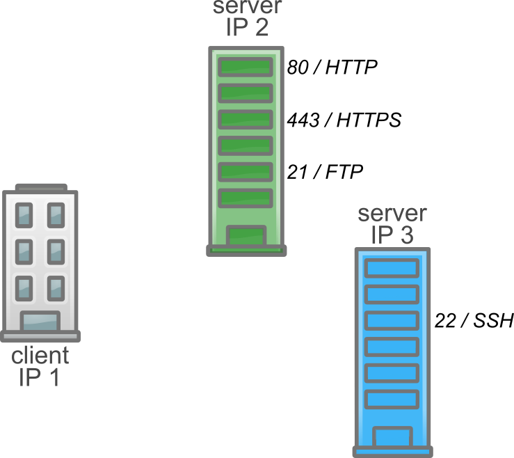
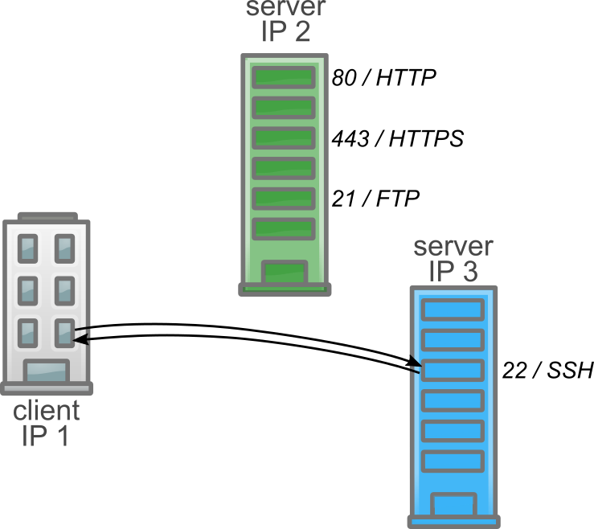
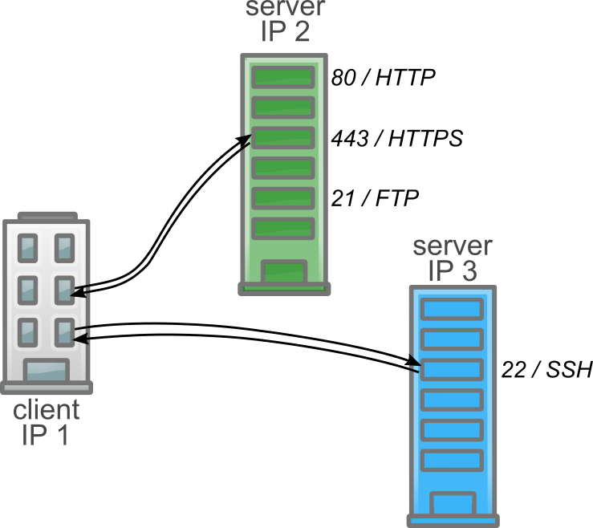
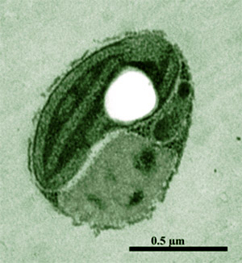

class: center, middle

# Formats & échanges de données

## DU Omiques 2019

Pierre Poulain / @pierrepo

      

 </img>

 </img>

.footer[
Ce contenu est mis à disposition selon les termes de la licence Creative Commons Attribution 4.0 International (CC BY 4.0)
]

---

name: title
class: center, middle

.footer[
DU Omiques 2019
]

---

name: contentleft
class: top, left

.footer[
DU Omiques 2019
]

---

layout: true
name: contentcenter
class: top, center

.footer[
DU Omiques 2019
]

---

# Communication

   

--

définir une langue commune

--

.fas.fa-arrow-down[]

protocoles de communication

.fas.fa-arrow-down[]

des normes & des formats

---

template: title

# Protocoles de communication

---

## Protocoles de communications

</img>

.footnote[
IP : `216.58.205.100`
]

---

## Protocoles de communications

</img>

---

## Protocoles de communications

</img>

---

## Protocoles de communications

 </img>

---

## Protocoles de communications

.pure-table[
| Protocole | Port | Signification |
|-----------|------|:--------------|
| HTTP      | 80   | *Hypertext Transfer Protocol* (`http://`) |
| HTTPS     | 443  | *HyperText Transfer Protocol Secure* (`https://`) |
| FTP       | 21   | *File Transfert Protocol* (`ftp://`) |
| SSH       | 22   | *Secure Shell* |
]

     

.footnote[
Pour aller plus loin :
[C’est quoi la différence entre HTTP et HTTPS ?](https://www.culture-informatique.net/cest-quoi-difference-http-https/)
]

---

## Protocoles de communications

.pure-table[
| Protocole | Port | Signification |
|-----------|------|---------------|
| IMAP      | 143  | *Internet Message Access Protocol* |
| IMAP/TLS  | 993  | + *Transport Layer Security* |
| SMTP      | 25   | *Simple Mail Transfer Protocol* |
| SMTP/TLS  | 587  | + *Transport Layer Security* |
]

---

template: title

# Formats (de fichiers)

---

class: hands-on

</img>

--

*Ostreococcus tauri*

.ref.footnote[
Crédit : Hervé Moreau, Laboratoire Arago. [Image](https://genome.jgi.doe.gov/Ost9901_3/Ost9901_3.home.html)
]

---

template: contentleft

## Génome de *Ostreococcus tauri*

- Allez sur <http://bioinformatics.psb.ugent.be/orcae/>
- Puis sur **Ostreococcus tauri (V2)**
- Combien *O. tauri* possède de chromosomes ?
- Cliquez sur **Download** puis **assembly_data** puis **O.tauri_genome_V2.1.tfa.gz**
- Essayez d'ouvrir le fichier téléchargé avec l'outil Bloc-notes de Windows.
Lancez d'abord le Bloc-notes puis glissez déposez le fichier sur l'application.

---

## Fichier binaire / texte

</img>
