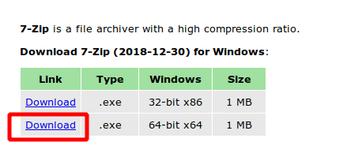
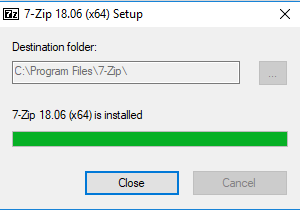

# Installation de 7-zip

[7-Zip](https://www.7-zip.org/) est un logiciel libre et gratuit pour Windows. Il est capable manipuler la plupart des formats d'archives existants.

C'est un logiciel spécifique à Windows. Des équivalents existent pour Mac et Linux (p7zip), mais ces systèmes prennent déjà bien en charge les archives compressées.

## Installation sous Windows

Dans un navigateur internet, ouvrez le site de [7-Zip](https://www.7-zip.org/).

Dans le tableau en haut de la page, cliquez sur le lien *Download* correspond à *64-bit x64* :

Enregistrez le ficher proposé au téléchargement. Ici *7z1806-x64.exe*, mais le nom peut être légèrement différent si une nouvelle version est disponible..

Une fois téléchargé, retrouvez où le fichier a été enregistré (a priori dans le répertoire *Téléchargements*).

Double-cliquez sur le fichier. La procédure d'installation va se lancer.

Autorisez l'installation en cliquant sur *Oui* :

Validez le répertoire d'installation en cliquant sur *Install* :

Une fois l'installation terminée, cliquez sur *Close*.

Bravo 🎉
