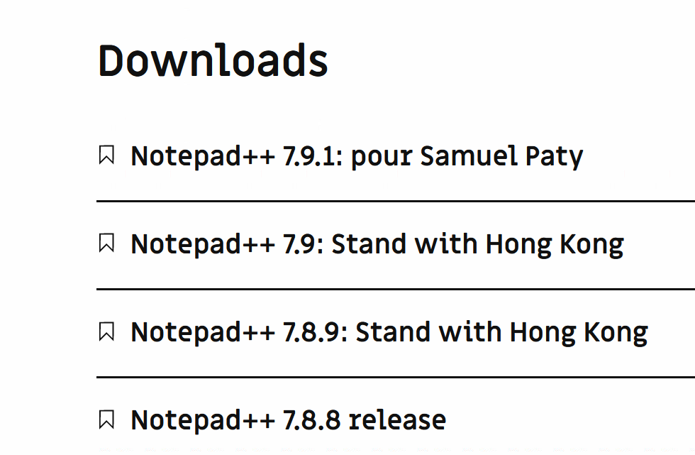
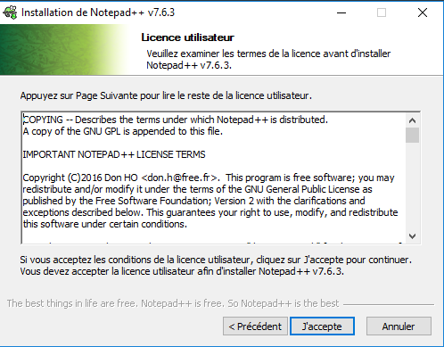

# Installation de Notepad++

[Notepad++](https://notepad-plus-plus.org/fr/) est un logiciel libre et gratuit. C'est un éditeur de texte très performant pour Windows.

Dans un navigateur internet, ouvrez le site de [Notepad++](https://notepad-plus-plus.org/fr/).

Cliquez sur *download* dans le menu à gauche.

Déplacez-vous à la rubrique *Download 64-bit x64* puis cliquez sur **Notepad++ Installer 64-bit x64** :

Enregistrez le ficher proposé au téléchargement. Ici *npp.7.6.3.Installer.x64.exe*, mais le nom peut être légèrement différent si une nouvelle version est disponible.

Une fois téléchargé, retrouvez où le fichier a été enregistré (a priori dans le répertoire *Téléchargements*).

Double-cliquez sur le fichier. La procédure d'installation va se lancer.

Autorisez l'installation en cliquant sur *Oui* :

Choisissez la langue *Français* puis cliquez sur *OK* :

Cliquez sur *Suivant* :

Validez la licence utilisateur en cliquant sur *J'accepte* :

Validez le répertoire d'installation en cliquant sur *Suivant* :

Laissez les composants par défaut et cliquez sur *Suivant* :

Enfin, cliquez sur *Installer* (vous pouvez cocher *Create Shortcut on Desktop* si vous le souhaitez) :

Quand l'installation est terminée, cliquez sur *Fermer* :

Bravo 🎉
