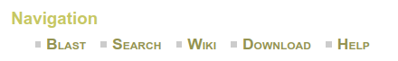
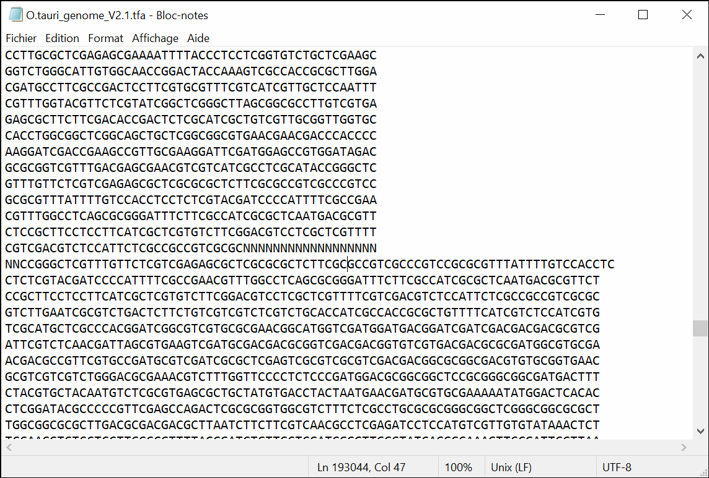

# Tutoriel

# Exploration du génome d'*Ostreococcus tauri*

## Partie 1 : téléchargement des données

1. Allez sur le site [Online Resource for Community Annotation of Eukaryotes (OrcAE)](http://bioinformatics.psb.ugent.be/orcae/)
2. Cliquez sur **Ostreococcus tauri (V2)**.
    
    Attention de bien prendre la **V2**, c'est important !  
    Le serveur peut mettre du temps à répondre. Patientez quelques instants.
3. Combien *O. tauri* possède de chromosomes ?
4. Cliquez ensuite sur **Download**  
      
    puis **assembly_data** puis **O.tauri_genome_V2.1.tfa.gz**
5. Trouvez où ce fichier a été téléchargé sur votre ordinateur (a priori dans le répertoire *Téléchargements*) puis déterminez sa taille.
6. Essayez maintenant d'ouvrir le fichier téléchargé avec l'outil *Bloc-notes* de Windows. Pour ce faire :
    - Lancez d'abord *Bloc-notes* avec la petite loupe dans la barre d'outils en bas ([aide](img/bloc-notes_aide.png)).
    - Puis glisser-déposez le fichier sur l'application.
    - Que lisez-vous ?

> **Éléments de réponse :**
> > *O. tauri* contient 20 chromosomes. Vous pouvez le vérifiez sur ce [schéma](https://bioinformatics.psb.ugent.be/orcae/overview/OsttaV2)
> >
> > Le fichier se trouve a priori dans le répertoire *Téléchargements*. Le fichier a une taille d'environ 3,8 Mo.
> >
> > Quand on ouvre le fichier O.tauri_genome_V2.1.tfa.gz avec l'application *Bloc-notes*, on obtient :
> > 
> > Le fichier n'est pas très lisible. C'est normal car O.tauri_genome_V2.1.tfa.gz n'est pas un fichier texte. C'est un fichier compressé donc binaire.
> > On ne peut pas ouvrir de fichier binaire avec un éditeur de texte. En fait, on peut techniquement (vous venez de le faire), mais cela n'a aucun intérêt.
{:.answer}

## Partie 2 : éditeurs de texte

### 2.1 Préparation

1. Installez le logiciel *Notepad++* sur votre machine. Vous trouverez une notice détaillée [ici](https://omics-school.github.io/formats-echanges-donnees/install-notepadpp/).
1. Vérifiez que le logiciel *7-zip* est bien installé. Si ce n'est pas le cas, installez-le sur votre machine. Vous trouverez une notice détaillée [ici](https://omics-school.github.io/formats-echanges-donnees/install-7zip/).

### 2.2 Visualisation du génome avec *Bloc-notes*

1. Décompressez le fichier *O.tauri_genome_V2.1.tfa.gz*.  
    Pour cela, cliquez droit sur le fichier puis sélectionnez *7-zip -> Extraire Ici*
1. Ouvrez le fichier *O.tauri_genome_V2.1.tfa* avec *Bloc-notes*.  
    Remarque : lancez d'abord *Bloc-notes* puis glisser-déposez le fichier sur l'application.
1. Recherchez les chromosomes de *O. tauri* en pressant les touches <kbd>Ctrl</kbd>+<kbd>F</kbd> puis en entrant le motif `>chrom` puis en cliquant sur le bouton *Suivant* ([aide](img/bloc-notes_recherche.png)).  
    Retrouvez-vous le bon nombre de chromosomes ?
1. L'affichage du fichier est-il cohérent avec vos connaissances du format FASTA ?   
    Allez jeter un oeil vers la ligne 193044.
1. Fermez le *Bloc-notes*.

> **Éléments de réponse :**
> > Quand on ouvre le fichier *O.tauri_genome_V2.1.tfa* avec *Bloc-notes* on obtient :
> > 
> >
> > La fonction *Rechercher* (obtenue en pressant les touches <kbd>Ctrl</kbd>+<kbd>F</kbd>) permet de les retrouver un par un
> > 
> > En cliquant plusieurs fois sur le bouton *Suivant*, on retrouve les 20 chromosomes.
> >
> > Dans un fichier FASTA, les séquences sont réparties sur des lignes avec un nombre fixe de caractères. Cela ne semble pas être toujours le cas ici, par exemple à partir de la ligne 193044 !
> > 
{:.answer}

### 2.3 Visualisation du génome avec *Notepad++*

1. Ouvrez le même fichier avec l'éditeur de texte *Notepad++*.
1. Que signifie `LF` dans la barre en bas de la fenêtre ?
1. Avec votre souris, sélectionnez une ligne entière contenant un morceau de séquence puis regardez la barre en bas de la fenêtre.  
    Sur combien de caractères par ligne sont réparties les séquences des chromosomes de *O. tauri* ?
1. Vérifiez que tous les chromosomes de *O. tauri* sont bien là en pressant les touches <kbd>Ctrl</kbd>+<kbd>F</kbd> puis en entrant le motif `>chrom` puis en cliquant sur le bouton *Suivant*.
1. Voyez-vous un moyen de compter très rapidement le nombres de chromosomes ?

Notepad++ est beaucoup plus puissant que Bloc-notes. Nous vous recommandons fortement son utilisation !

> **Éléments de réponse :**
> > Quand on ouvre le fichier *O.tauri_genome_V2.1.tfa* avec le *Notepad++* on obtient :
> > 
> > La mention `LF` dans la barre en bas de la fenêtre signifie que le fichier a été créé sous Unix avec lequel les fins de lignes sont `LF` (contre `CR+LF` sous Windows).
> >
> > En sélectionnant une ligne complète, la barre en bas indique le nombre de caractères. Ici 50.
> > 
> >
> > En utilisant la fonction *Rechercher* de *Notepad++*, on retrouve les 20 chromosomes.
> > 
> >
> > On peut même les compter très rapidement en cliquant sur le bouton *Compter* :
> > 
{:.answer}

# Partie 3 : le jeu des différences

### 3.1 Préparation

Vérifiez que le logiciel *Meld* est bien installé. Si ce n'est pas le cas, installez-le sur votre machine. Vous trouverez une notice détaillée [ici](https://omics-school.github.io/formats-echanges-donnees/install-meld/).

Téléchargez les séquences protéiques, au format FASTA, de la déhydrogénase :
- de l'homme (P04406) - [UniProt](https://www.uniprot.org/uniprot/P04406) - [local](files/P04406.fasta)
- du gibbon à favoris blancs du Nord (G1QVR0) -  [UniProt](https://www.uniprot.org/uniprot/G1QVR0) - [local](files/G1QVR0.fasta)

### 3.2 Recherche des différences entre deux séquences de déhydrogénase

1. Lancez *Meld*, cliquez sur *File comparison*, cliquez sur *(None)* et sélectionnez les deux fichiers FASTA l'un après l'autre ([aide](img/meld_file_comp.png)). Enfin, cliquez sur *Compare*.
1. Identifiez la position et le type des acides aminés qui diffèrent entre les 2 séquences.

> **Éléments de réponse :**
> > 
> > Les acides aminés différents entre l'homme et le gibbon sont :
> >
> > | Position | Homme | Gibbon |
> > |----------|-------|--------|
> > | 147      | Ile   | Val    |
> > | 329      | Ala   | Ser    |
> >
> > Le calcul de la position se fait en repérant le numéro (dans la barre en bas de la fenêtre) du caractère correspondant à la mutation puis en ajoutant le nombre de caractères des lignes d'avant (60 caractères par ligne).
> > Cette méthode est bien sur "artisanale". Pour des séquences plus grandes ou plus nombreuses, il faudrait automatiser cette comparaison avec un programme écrit en Python ou en R 😇.
{:.answer}

# Partie 4 : contrôle d'intégrité

## 4.1 Préparation

Sur le site [Zenodo](https://zenodo.org/record/154453), vous trouverez les données d'une étude sur la malaria ayant pour titre
« *Plasmodium falciparum infection in febrile Congolese children: prevalence of clinical malaria ten years after introduction of Artemisinin-combination therapies* ».

En bas de la page, dans la rubrique *Files*, téléchargez les fichiers :

- `mng2015_children_malaria_codebook.txt`
- `mng2015_children_malaria_data.csv`

Si lors du téléchargement, Firefox vous demande quoi faire avec ces fichiers, choisissez *Enregistrer le fichier*.

Notez les empreintes MD5 fournies sous chaque fichiers :

Repérez où ont été téléchargés les fichiers (a priori dans le répertoire *Téléchargements*).

## 4.2 Calcul des empreintes

Depuis votre machine, lancez le logiciel *WinMD5* ([aide](img/winmd5_aide.png)).

En cliquant sur le bouton *Browse*, ouvrez le fichier `mng2015_children_malaria_codebook.txt`. 

Comparez l'empreinte MD5 calculée (dans le champ texte *Current file MD5 checksum value*) avec l'empreinte fournie sur le site Zenodo où vous avez téléchargé les données.

Répétez l'opération avec le fichier `mng2015_children_malaria_data.csv`.

## 4.3 Collision 😱

**Attention, cette cascade n'a pas été réalisée par un professionnel, essayez surtout de la reproduire chez vous.**

Téléchargez les deux images ci-dessous en cliquant droit sur chaque image puis en choisissant *Enregistrer l'image sous...*.

Toujours avec le logiciel WinMD5, calculez l'empreinte MD5 de ces deux photos (`souvlaki_coll.jpg` et `gyra_coll.jpg`, l'extension `.jpg` peut ne pas apparaitre dans l'explorateur de fichiers). Notez bien l'empreinte à chaque fois. 

Comparez ensuite les deux empreintes. Si elles sont identiques, alors que les deux images sont portant bien différentes, vous venez d'assister à une collision de l'algorithme MD5. Bravo ! 🥳

Source : les images proviennent du blog [Emaragkos.gr](https://emaragkos.gr/infosec-adventures/create-your-own-md5-collisions/).

> **Éléments de réponse :**
> > Pour les deux images, l'empreinte MD5 est `59bbfd270bdf5817c5d77e739839a02a`.
{:.answer}
