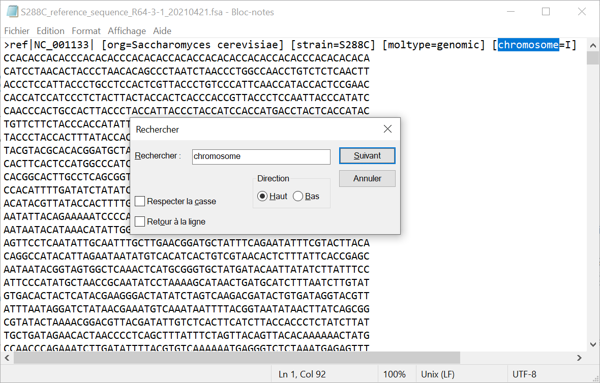
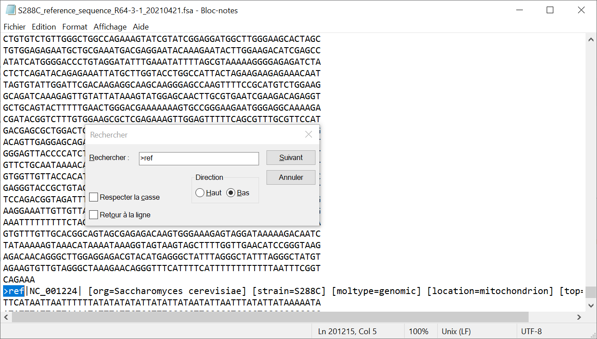
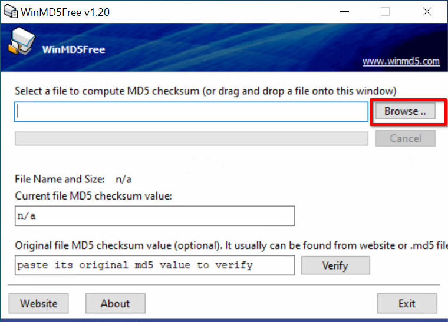
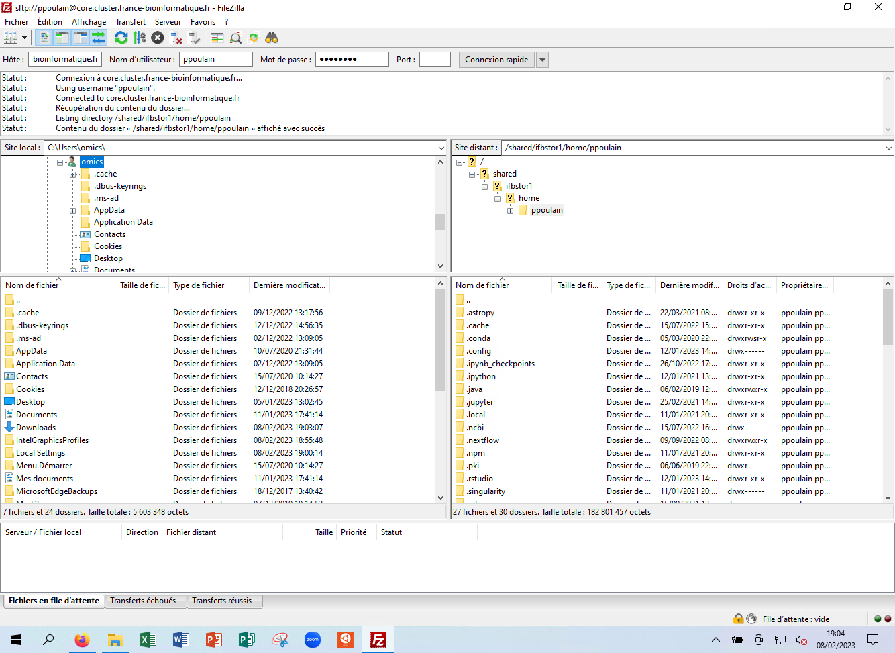

# Tutoriel

# Exploration du génome de *Sacharomyces cerevisiae*

## Partie 1 : téléchargement des données

1. Téléchargez le génome de *S. cerevisiae* :
[*S288C_reference_sequence_R64-3-1_20210421.fsa.gz*](files/S288C_reference_sequence_R64-3-1_20210421.fsa.gz).
    Ce fichier provient de la [Saccharomyces Genome Database (SGD)](https://www.yeastgenome.org/).
1. Trouvez où ce fichier a été téléchargé sur votre ordinateur (a priori dans le répertoire *Téléchargements*) puis déterminez sa taille.
1. Essayez maintenant d'ouvrir le fichier téléchargé avec l'application *Bloc-notes* de Windows. Pour ce faire :
    - Lancez d'abord *Bloc-notes* avec la petite loupe dans la barre d'outils en bas ([aide](img/bloc-notes_aide.png)).
    - Puis glisser-déposez le fichier sur l'application.
    - Que lisez-vous ?
1. Fermez l'application *Bloc-notes*.

> **Éléments de réponse :**
> > Le fichier se trouve a priori dans le répertoire *Téléchargements*. Le fichier a une taille d'environ 3,7 Mo.
> >
> > Quand on ouvre le fichier *S288C_reference_sequence_R64-3-1_20210421.fsa.gz* avec l'application *Bloc-notes*, on obtient :
> > 
> > Le fichier n'est pas très lisible. C'est normal car *S288C_reference_sequence_R64-3-1_20210421.fsa.gz* n'est pas un fichier texte. C'est un fichier compressé donc binaire.<br />
> > On ne peut pas ouvrir de fichier binaire avec un éditeur de texte. En fait, on peut techniquement (vous venez de le faire), mais cela n'a aucun intérêt.
{:.answer}


## Partie 2 : éditeurs de texte

### 2.1 Préparation

1. Vérifiez que le logiciel *Notepad++* est bien installé sur votre machine en essayant de le lancer (puis en le refermant). Si ce n'est pas le cas, installez-le en suivant la notice détaillée [ici](https://pierrepo.github.io/formats-echanges-donnees-biologie/install-notepadpp/). Si le logiciel vous demande de se mettre à jour, acceptez et suivez la procédure.
1. Vérifiez également que le logiciel *7-zip* est bien installé (toujours en le lançant puis en le refermant). Si ce n'est pas le cas, installez-le en suivant la notice détaillée [ici](https://pierrepo.github.io/formats-echanges-donnees-biologie/install-7zip/).

### 2.2 Visualisation du génome avec *Bloc-notes*

1. Décompressez le fichier *S288C_reference_sequence_R64-3-1_20210421.fsa.gz*.  
    Pour cela, cliquez droit sur le fichier puis sélectionnez *7-zip -> Extraire Ici*.
    Un nouveau fichier *S288C_reference_sequence_R64-3-1_20210421.fsa* devrait apparaître dans le même répertoire.
1. Ouvrez le fichier *S288C_reference_sequence_R64-3-1_20210421.fsa* avec *Bloc-notes*.  
    Remarque : lancez d'abord *Bloc-notes* puis glisser-déposez le fichier sur l'application.
1. Quel est le nombre maximum de bases par ligne ?
1. Combien de séquences sont disponibles dans ce fichier ?
    Pour cela, pressez les touches <kbd>Ctrl</kbd>+<kbd>F</kbd>, entrez le motif `>ref` dans le champ *Rechercher* puis cliquez sur le bouton *Suivant* ([aide](img/bloc-notes_recherche.png)).  
    Combien de séquences trouvez-vous ?
1. En utilisant la même procédure, mais cette fois en recherchant le mot clé `chromosome`, déterminez le nombre de chromosomes de *S. cerevisiae* ([aide](img/bloc-notes_recherche_chromo.png)).
1. À quoi correspond la séquence qui n'est pas un chromosome ?
1. Fermez l'application *Bloc-notes*.

> **Éléments de réponse :**
> > Quand on ouvre le fichier *S288C_reference_sequence_R64-3-1_20210421.fsa* avec *Bloc-notes* on obtient :
> > 
> > 
> > Les lignes de séquences sont formatées avec un maximum de 60 bases par ligne.
> >
> > La fonction *Rechercher* (obtenue en pressant les touches <kbd>Ctrl</kbd>+<kbd>F</kbd>) permet de retrouver toutes les séquences 
> > 
> > En cliquant plusieurs fois sur le bouton *Suivant*, on trouve 17 séquences.
> > 
> > En cherchant le mot-clé `chromosome`, on trouve 16 chromosomes.
> > 
> > 
> > La 17e séquence correspond à la séquence de l'ADN mitochondrial :
> > 
> >
{:.answer}


### 2.3 Visualisation du génome avec *Notepad++*

1. Ouvrez le même fichier avec l'éditeur de texte *Notepad++*.  
    Remarque : lancez d'abord *Notepad++* puis glisser-déposez le fichier sur l'application.
1. Que signifie `Unix (LF)` dans la barre en bas de la fenêtre ?
1. Avec votre souris, sélectionnez une ligne entière contenant un morceau de séquence puis regardez la barre en bas de la fenêtre.  
    Sur combien de caractères par ligne sont réparties les séquences des chromosomes de *S. cerevisiae* ?
1. Vérifiez que tous les chromosomes de *S. cerevisiae* sont bien là en pressant les touches <kbd>Ctrl</kbd>+<kbd>F</kbd> puis en entrant le motif `chromosome` puis en cliquant sur le bouton *Suivant*.
1. Voyez-vous un moyen de compter très rapidement le nombres de chromosomes ?

[*Notepad++*](https://notepad-plus-plus.org/) est beaucoup plus puissant que *Bloc-notes* et c'est un logiciel libre (*open source*). Nous vous recommandons fortement son utilisation !

> **Éléments de réponse :**
> > Quand on ouvre le fichier *S288C_reference_sequence_R64-3-1_20210421.fsa* avec *Notepad++* on obtient :
> > 
> > La mention `Unix(LF)` dans la barre en bas de la fenêtre signifie que le fichier a été créé sous Unix pour lequel les fins de lignes sont `LF` (contre `CR+LF` pour un fichier créé sous Windows).
> >
> > En sélectionnant une ligne complète, la barre en bas indique le nombre de caractères. Ici 60.
> > 
> >
> > En utilisant la fonction *Rechercher* de *Notepad++*, on retrouve les 16 chromosomes.
> > 
> >
> > On peut même les compter très rapidement en cliquant sur le bouton *Compter* :
> > 
> >
> > On peut automatiser très simplement cette recherche de motif (`chromosome`) et le comptage associé pour des dizaines voire des milliers de fichiers avec un outil comme Unix que nous aborderons prochainement.
{:.answer}


# Partie 3 : le jeu des différences

### 3.1 Préparation

Vérifiez que le logiciel *Meld* est bien installé. Si ce n'est pas le cas, installez-le en suivant la notice détaillée [ici](https://pierrepo.github.io/formats-echanges-donnees-biologie/install-meld/).

Téléchargez les séquences protéiques, au format FASTA, de la déhydrogénase :
- de l'homme ([P04406](https://www.uniprot.org/uniprot/P04406)) - [fichier FASTA](files/P04406.fasta)
- du gibbon à favoris blancs du Nord ([G1QVR0](https://www.uniprot.org/uniprot/G1QVR0)) - [fichier FASTA](files/G1QVR0.fasta)

### 3.2 Recherche des différences entre deux séquences de déhydrogénase avec Meld

1. Lancez *Meld*, cliquez sur *File comparison*, cliquez sur *(None)* et sélectionnez les deux fichiers FASTA l'un après l'autre ([aide](img/meld_file_comp.png)). Enfin, cliquez sur *Compare*.
    
    Remarque : vos fichiers sont a priori dans le répertoire *Downloads*.
1. Identifiez les position et les types des acides aminés qui diffèrent entre les 2 séquences.

> **Éléments de réponse :**
> > 
> > Les acides aminés différents entre l'homme et le gibbon sont :
> >
> > | Position | Homme | Gibbon |
> > |----------|-------|--------|
> > | 147      | Ile   | Val    |
> > | 329      | Ala   | Ser    |
> >
> > Le calcul de la position se fait en repérant le numéro (dans la barre en bas de la fenêtre) du caractère correspondant à la mutation puis en ajoutant le nombre de caractères des lignes d'avant (60 caractères par ligne).
> >
> > Cette méthode est bien sur « artisanale ». Pour des séquences plus grandes ou plus nombreuses, il faudrait automatiser cette comparaison avec un programme écrit en Python ou en R par exemple 😇.
{:.answer}


### 3.3 Recherche des différences entre deux séquences de déhydrogénase avec Notepad++

L'éditeur de texte *Notepad++* propose une extension qui permet, tout comme *Meld* de comparer deux fichiers textes.

En suivant les instructions de cet [article de blog](https://www.it-connect.fr/comment-comparer-deux-fichiers-avec-notepad/) sur le sujet et de la [vidéo correspondante](https://www.youtube.com/watch?v=bLWv-GOxJX8), installez le module *Compare* dans *Notepad++*.

Ouvrez ensuite les deux fichiers FASTA précédents (`P04406.fasta` et `G1QVR0.fasta`) dans *Notepad++*.

Comparez les fonctionnalités et l'ergonomie du module *Compare* de *Notepad++* par rapport à *Meld*.


# Partie 4 : contrôle d'intégrité

### 4.1 Préparation

Sur le site [Zenodo](https://zenodo.org/), vous trouverez les données d'une étude sur le paludisme publié en 2016 :   
Etoka-Beka et al. TMIH, DOI [10.1111/tmi.12786](https://onlinelibrary.wiley.com/doi/10.1111/tmi.12786).

Ouvrez [ici](https://zenodo.org/record/154453) le dépôt Zenodo correspondant à ces données.

En bas de la page, dans la rubrique *Files*, téléchargez les fichiers :

- `mng2015_children_malaria_codebook.txt`
- `mng2015_children_malaria_data.csv`

Si lors du téléchargement, Firefox vous demande quoi faire avec ces fichiers, choisissez *Enregistrer le fichier*.

Notez les empreintes MD5 fournies sous chaque fichier :


Repérez où ont été téléchargés les fichiers (a priori dans le répertoire *Téléchargements*).

**Remarque :** Zenodo est un site très intéressant pour archiver certaines données scientifiques.


### 4.2 Calcul des empreintes

Depuis votre machine, lancez le logiciel *WinMD5* ([aide](img/winmd5_aide.png)).

En cliquant sur le bouton *Browse*, ouvrez le fichier `mng2015_children_malaria_codebook.txt`. 



Comparez l'empreinte MD5 calculée (dans le champ texte *Current file MD5 checksum value*) avec l'empreinte fournie sur le site Zenodo où vous avez téléchargé les données.

Répétez l'opération avec le fichier `mng2015_children_malaria_data.csv`.

Ouvrez maintenant le fichier `mng2015_children_malaria_data.csv` avec *Notepad++* et remplacez le 1er caractère de la 1ère ligne (`p`) par `P` (majuscule). Enregistrez le fichier modifié.

Calculez la nouvelle somme de contrôle du fichier `mng2015_children_malaria_data.csv` et comparez-la à la précédente.

> **Éléments de réponse :**
> > Si les deux fichiers ont été téléchargés correctement, les empreintes calculées doivent normalement correspondre à celles indiquées sur Zenodo.
> >
> > Une fois le premier caractère du fichier `mng2015_children_malaria_data.csv` modifié,
> > l'empreinte MD5 obtenue est totalement différente de la première.  
> > Il n'y a **aucune relation** entre deux sommes de contrôle même s'il n'y a qu'un seul caractère
> > de différence entre les deux fichiers.
{:.answer}


### 4.3 Collision 😱

**Attention, cette cascade n'a pas été réalisée par un professionnel, essayez surtout de la reproduire chez vous.**

Téléchargez les deux images ci-dessous en cliquant droit sur chaque image puis en choisissant *Enregistrer l'image sous...*.


Toujours avec le logiciel *WinMD5*, calculez l'empreinte MD5 de ces deux photos (`souvlaki_coll.jpg` et `gyra_coll.jpg`, l'extension `.jpg` peut ne pas apparaitre dans l'explorateur de fichiers).

Notez bien l'empreinte à chaque fois. 

Comparez ensuite les deux empreintes. Si elles sont identiques, alors que les deux images sont portant bien différentes, vous venez d'assister à une collision de l'algorithme MD5. Bravo ! 🥳

> **Éléments de réponse :**
> > Pour les deux images, l'empreinte MD5 est `59bbfd270bdf5817c5d77e739839a02a`.
> > 
{:.answer}

La collision MD5 que vous avez observée n'est pas due au hasard. Un algorithme particulier a été utilisé pour créer cette collision.

L'algorithme MD5 est donc à proscire en sécurité informatique. Il est néanmoins parfaitement utilisable (et encore très utilisé) dans un contexte scientifique.

Source : les images proviennent du blog [Emaragkos.gr](https://emaragkos.gr/infosec-adventures/create-your-own-md5-collisions/).


# Partie 5 : transfert de données

Le dernier aspect abordé dans ce tutoriel concerne le transfert de données, depuis votre machine locale vers un serveur distant (le serveur RStudio de l'IFB par exemple) et inversement.

Nous allons pour cela utiliser le logiciel [FileZilla](https://filezilla-project.org/), logiciel libre et gratuit, disponible pour Windows, Linux et Mac.

1. Lancez d'abord *FileZilla* avec la petite loupe dans la barre d'outils en bas ([aide](img/filezilla_lancement.png)).
1. Tout en haut, dans le champ *Hôte* indiquez l'adresse du serveur de l'IFB : 
    ```
    sftp://core.cluster.france-bioinformatique.fr
    ```
    (voir remarque plus bas concernant l'adresse du serveur).
1. Dans le champ *Nom d'utilisateur*, indiquez le nom d'utilisateur de votre compte sur le serveur de l'IFB.
1. Dans le champ *Mot de passe*, indiquez le mot de passe de votre compte sur le serveur de l'IFB.
1. Cliquez enfin sur le bouton *Connexion rapide*.

Lors de la première connexion : 

1. Acceptez d'enregistrer vos informations de connexion dans FileZilla.
2. Dans la fenêtre *Clef de l'hôte inconnue*, cochez « *Toujours faire confiance à cet hôte, ajoutez cette clef au cache* » et cliquez sur le bouton *OK*.

Une fois connecté, la fenêtre de FileZilla devrait ressembler à ceci (cliquez pour aggrandir) :

<a href="img/filezilla_connexion_ifb.png"></a>

- Cet [autre graphique](img/filezilla.png) décompose les différents panneaux de la fenêtre FileZilla.
- Sur le serveur distant, votre répertoire utilisateur est de la forme `/shared/ifbstore1/home/LOGIN` où `LOGIN` est votre nom d'utilisateur. Nous verrons lors de la prochaine session ce que signifie `/shared/ifbstore1/home/...`.

Ensuite :

1. Dans FileZilla, dans le panneau de gauche correspondant à vos répertoires et fichiers locaux, déplacez-vous dans le répertoire *Downloads* (ou *Téléchargements*).
1. Retrouvez le fichier correspondant au génome de *S. cerevisiae* **décompressé**
    (fichier `S288C_reference_sequence_R64-3-1_20210421.fsa`).
1. Double-cliquez sur ce fichier pour le transférer vers le serveur de l'IFB.
1. Quelques instants plus tard, il devrait apparaître dans le panneau de droite, correpondant à vos répertoires et fichiers distants (c'est-à-dire sur le serveur de l'IFB). Au besoin, utilisez l'ascenseur à droite de la fenêtre pour parcourir tous les fichiers du répertoire.
1. Faites le transfert inverse, en double-cliquant sur un fichier dans le panneau de droite. Vous tranférerez ainsi ce fichier depuis le serveur distant vers votre machine. Vérifie que ce fichier est bien présent sur votre machine (panneau de gauche).
1. Dans un navigateur web, connectez-vous au serveur RStudio de l'IFB : <https://rstudio.cluster.france-bioinformatique.fr/> Vérifiez que le fichier du génome de *S. cerevisiae* apparait bien en bas à droite dans l'explorateur de fichiers (déplacez-vous si besoin dans votre répertoire utilisateur qui est sous la forme `/shared/ifbstore1/home/LOGIN` où `LOGIN` est votre nom d'utilisateur).

**Remarque :** lors de la dernière session, vous avez utilisé l'adresse <https://rstudio.cluster.france-bioinformatique.fr/> comme adresse du serveur RStudio de l'IFB. Pour un transfert de fichiers par FileZilla (via le protocole SSH), il faut se connecter au serveur `sftp://core.cluster.france-bioinformatique.fr`. Vous verrez par contre que les mêmes répertoires sont visibles d'un serveur à l'autre.

# Partie 6 : pour terminer avec un peu d'humour

Commentez ce [dessin](https://xkcd.com/2298/) du blog XKCD :


## Licence


Ce contenu est mis à disposition selon les termes de la licence [Creative Commons Attribution - Partage dans les Mêmes Conditions 4.0 International](https://creativecommons.org/licenses/by-sa/4.0/deed.fr) (CC BY-SA 4.0). Consultez le fichier [LICENSE](LICENSE) pour plus de détails.

This content is released under the [Creative Commons Attribution-ShareAlike 4.0 ](https://creativecommons.org/licenses/by-sa/4.0/deed.en) (CC BY-SA 4.0) license. See the bundled [LICENSE](LICENSE) file for details.
