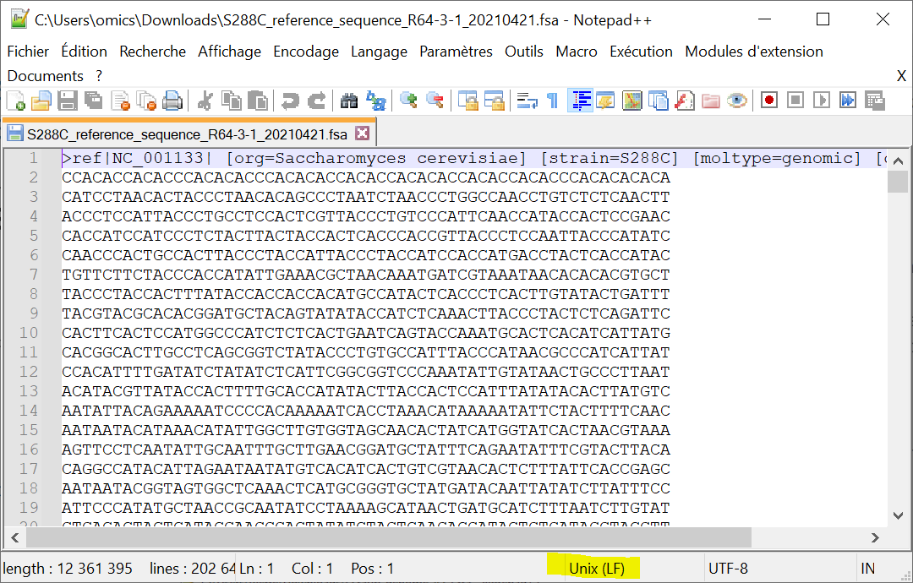
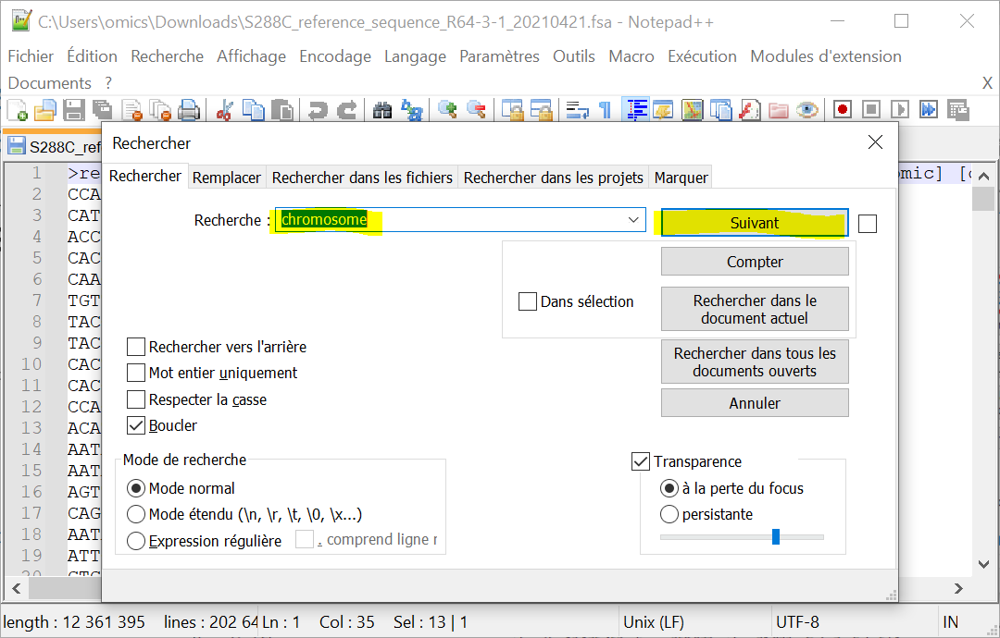

# Tutoriel

# Exploration du génome d'*Ostreococcus tauri*

## Partie 1

1. Allez sur le site [Online Resource for Community Annotation of Eukaryotes (OrcAE)](http://bioinformatics.psb.ugent.be/orcae/)
1. Cliquez sur **Ostreococcus tauri (V2)**
    
    Attention de bien prendre la **V2** !
1. Combien *O. tauri* possède de chromosomes ?
1. Cliquez ensuite sur **Download** puis **assembly_data** puis **O.tauri_genome_V2.1.tfa.gz**
1. Trouvez où ce fichier a été téléchargé sur votre ordinateur puis déterminez sa taille.
1. Essayez maintenant d'ouvrir le fichier téléchargé avec l'outil *Bloc-notes* de Windows. Pour ce faire :
    - Lancez d'abord *Bloc-notes* avec Cortana ([aide](img/bloc-notes_cortana.png))
    - Puis glisser-déposez le fichier sur l'application.
    - Que lisez-vous ?

> **Réponses :**
> > *O. tauri* contient 20 chromosomes. Vous pouvez le vérifiez sur ce [schéma](https://bioinformatics.psb.ugent.be/orcae/overview/OsttaV2)
> >
> > Le fichier se trouve a priori dans le répertoire *Téléchargements*. Le fichier a une taille d'environ 3,8 Mo.
> >
> > Quand on ouvre le fichier O.tauri_genome_V2.1.tfa.gz avec l'application *Bloc-notes*, on obtient :
> > 
> > Le fichier n'est pas très lisible. C'est normal car O.tauri_genome_V2.1.tfa.gz n'est pas un fichier texte. C'est un fichier compressé donc binaire.
> > On ne peut pas ouvrir de fichier binaire avec un éditeur de texte. En fait, on peut techniquement (vous venez de le faire), mais cela n'a aucun intérêt.
{:.answer}

## Partie 2

### Préparation

1. Installez le logiciel *7-zip* sur votre machine. Vous trouverez une notice détaillée [ici](https://omics-school.github.io/install-7zip).
1. Installez le logiciel *Notepad++* sur votre machine. Vous trouverez une notice détaillée [ici](https://omics-school.github.io/install-notepadpp).

### Visualisation du génome avec *Bloc-notes*

1. Décompressez le fichier *O.tauri_genome_V2.1.tfa.gz*. Cliquez droit sur le fichier puis sélectionnez *7-zip -> Extraire Ici*
1. Ouvrez le fichier *O.tauri_genome_V2.1.tfa* avec le *Bloc-notes*
    Remarque : lancez d'abord *Bloc-notes* puis glisser-déposez le fichier sur l'application.
1. Recherchez les chromosomes de *O. tauri* en pressant les touches <kbd>Ctrl</kbd>+<kbd>F</kbd> puis en entrant le motif `>chrom` puis en cliquant sur le bouton *Suivant* ([aide](img/bloc-notes_recherche.png)).
    Retrouvez-vous le bon nombre de chromosomes ?
1. L'affichage du fichier est-il cohérent avec vos connaissances du format FASTA ?
1. Fermez le *Bloc-notes*.

> **Réponses :**
> > Quand on ouvre le fichier *O.tauri_genome_V2.1.tfa* avec le *Bloc-notes* on obtient :
> > 
> > Difficile de voir où sont les différents chromosomes !
> > La fonction *Rechercher* permet de les retrouver un par un
> > 
> > En cliquant plusieurs fois sur le bouton *Suivant*, on retrouve les 20 chromosomes.
> >
> > Dans un fichier FASTA, les séquences sont réparties sur des lignes avec un nombre fixe de caractères. Cela ne semble pas être le cas ici.
{:.answer}

### Visualisation du génome avec *Notepad++*

1. Ouvrez le même fichier avec l'éditeur de texte *Notepad++*.
1. La lisibilité du fichier est-elle améliorée ?
    Que signifie `LF` dans la barre en bas de la fenêtre ?
1. Comment expliquez-vous cette différence de comportement entre *Bloc-notes* et *Notepad++* ?
1. Avec votre souris, sélectionnez une ligne entière contenant un morceau de séquence puis regardez la barre en bas de la fenêtre.
    Sur combien de caractères par ligne sont réparties les séquences des chromosomes de *O. tauri* ?
1. Vérifiez que tous les chromosomes de *O. tauri* sont bien là en pressant les touches <kbd>Ctrl</kbd>+<kbd>F</kbd> puis en entrant le motif `>chrom` puis en cliquant sur le bouton *Suivant*

> **Réponses :**
> > Quand on ouvre le fichier *O.tauri_genome_V2.1.tfa* avec le *Notepad++* on obtient :
> > 
> > Le fichier est beaucoup plus lisible. La mention `LF` dans la barre en bas de la fenêtre signifie que le fichier a été créé sous Unix avec lequel les fins de lignes sont `LF` (contre `CR+LF` sous Windows).
> >
> > *Bloc-notes* n'est capable de lire que des fichiers texte venant de Windows, c'est-à-dire avec des `CR+LF` comme caractères de fin de ligne. *Notepad++* est beaucoup plus polyvalent. C'est un vrai éditeur de texte !
> >
> > En sélectionnant une ligne complète, la barre en bas indique le nombre de caractères. Ici 50.
> > 
> >
> > En utilisant la fonction *Rechercher* de *Notepad++*, on retrouve les 20 chromosomes. On peut même les compter très rapidement.
> > 
> > 
{:.answer}

# Le jeu des différences

### Préparation

1. Installez le logiciel *Meld* sur votre machine. Vous trouverez une notice détaillée [ici](https://omics-school.github.io/install-meld).

### Recherche des différences entre deux séquences de déhydrogénase

1. Téléchargez les séquences protéiques, au format FASTA, de la déhydrogénase :
    - de l'homme (P04406) - [UniProt](https://www.uniprot.org/uniprot/P04406) - [local](files/P04406.fasta)
    - du gibbon à favoris blancs du Nord (G1QVR0) -  [UniProt](https://www.uniprot.org/uniprot/G1QVR0) - [local](files/G1QVR0.fasta)
1. Lancez *Meld*, cliquez sur *File comparison*, cliquez sur *(None)* et sélectionnez les deux fichiers FASTA l'un après l'autre. Enfin, cliquez sur *Compare*.
1. Identifiez la position et le type des acides aminés qui diffèrent entre les 2 séquences.

> **Réponses :**
> > 
> > Les acides aminés différents entre l'homme et le gibbon sont :
> >
> > | Position | Homme | Gibbon |
> > |----------|-------|--------|
> > | 147      | Ile   | Val    |
> > | 329      | Ala   | Ser    |
> >
> > Le calcul de la position se fait en repérant le numéro (dans la barre en bas de la fenêtre) du caractère correspondant à la mutation puis en ajoutant le nombre de caractères des lignes d'avant (60 caractères par ligne).
{:.answer}
